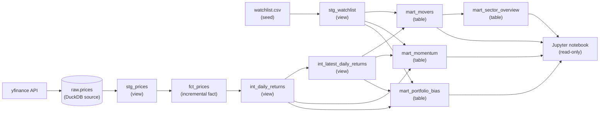

# market-movers-dbt: the pipeline, in plain language

This explains what the pipeline does, how the pieces connect (lineage), and what
happens when a step fails - including a demo you can run on command. Everything
below is verified against the live repo and a real `dbt build` run, not notes.

One picture to hold the whole way through: **a nightly factory line with QC
inspectors and an incident desk.** Raw parts arrive each night, move down a line
of stations that clean and assemble them into finished goods, and an inspector
checks the work at every station. When an inspector rejects something, a clerk
writes one clean incident report - it does not try to fix the line itself.

## Lineage (how the stations connect)



To explore this interactively, dbt draws its own version of this graph:

```bash
.venv/bin/dbt docs generate --profiles-dir .
.venv/bin/dbt docs serve --profiles-dir .   # opens the DAG explorer in a browser
```

That is the "track the lineage" tool - click any model to see its parents,
children, columns, tests, and compiled SQL. The diagram above is the same graph,
read straight from `target/manifest.json`.

## Each step, and why it is there

**1. Ingest - the nightly delivery.** `ingest.py` pulls daily price bars from the
yfinance API and lands them in `raw.prices` inside a DuckDB file. It runs on a
schedule via GitHub Actions (think Power Automate, but for code). *Why a raw
landing table:* keep an untouched copy of exactly what arrived, so every later
step is reproducible and you can always trace a number back to its source.

**2. Staging - the cleaning station.** Two views:
- `stg_prices` types the columns, de-duplicates a ticker-day if it was loaded
  twice (keeps the most recent), and drops rows with no close price.
- `stg_watchlist` is the tracked universe - which tickers, their sector, and
  holding/benchmark flags - read from the `watchlist.csv` seed (a seed is a
  static reference table you version in git, like a small Excel lookup list).

*Why views, not tables:* staging is cheap re-runnable logic on top of raw, so
there is no need to store a second physical copy. A view is a saved query; a
table is a stored extract.

**3. Fact - the main conveyor ledger.** `fct_prices` is the authoritative
one-row-per-ticker-per-trading-day record, with a surrogate key
(`ticker|trade_date`). It is **incremental**: each run only adds days newer than
what is already stored, instead of rebuilding all of history (like a delta
refresh in Power BI). *Why:* speed and stability - you touch only new data, and
same-day re-runs refresh cleanly rather than duplicating.

**4. Intermediate - the sub-assembly bench.** Two views:
- `int_daily_returns` turns raw prices into the building blocks analysts
  actually use: 1-day/5-day/1-month returns, 5- and 20-day moving averages,
  running peak, and drawdown from that peak.
- `int_latest_daily_returns` takes the single most recent row per ticker off
  `int_daily_returns`. This exists because three marts each need "today's
  snapshot per ticker" - computing it once here means the row-numbering logic
  lives in exactly one place instead of being copy-pasted into every mart.

*Why a separate layer at all:* every mart downstream needs these same
calculations, so compute them once here instead of repeating the window
functions in every mart.

**5. Marts - the finished-goods shelves.** Four dashboard-ready tables:
- `mart_movers` - latest snapshot per ticker (from `int_latest_daily_returns`),
  ranked by 1-day return (with 5-day and ~1-month returns).
- `mart_momentum` - trend (5d vs 20d average), drawdown, and how extreme today's
  move is versus that ticker's own volatility.
- `mart_portfolio_bias` - holdings only: each holding's correlation to the Nasdaq
  (QQQ) and its current drawdown.
- `mart_sector_overview` - one row per sector (benchmarks excluded), with breadth
  and the best/worst mover. *Why materialized as tables:* these are read by the
  notebook and should be fast and stable, not recomputed on every read.

**6. The QC inspectors - dbt tests.** 26 data tests run in the same pass as the
build (`dbt build`, not `dbt run` alone). They are the smoke detectors of the
pipeline. Examples of what they enforce:
- `not_null` / `unique` - no missing labels, no duplicate serial numbers (e.g.
  the `price_key` surrogate is unique).
- `accepted_values` - the `sector` column may only be `tech`, `industrials`,
  `financials`, `crypto`, or `benchmark`.
- `relationships` - every ticker in the fact must exist in the watchlist, so a
  finished good always traces back to a real part.

**7. Consumption - read-only.** The Jupyter notebook only reads the marts, over a
`read_only=True` DuckDB connection. *Why read-only:* DuckDB is single-writer - a
stray read connection left open would block the nightly build.

## What happens when a step fails (the incident desk)

Before this session, a failed test just turned the nightly run red and nothing
else happened. Now there is an incident desk.

When `dbt build` fails, a GitHub Actions step that runs **only on failure**
(`if: failure()`) calls `scripts/triage/capture_failure.py`. That script does **no AI
and no fixing**. It reads dbt's own artifacts (`run_results.json` +
`manifest.json`) and writes **one clean `failure_context.json`**: for each failed
node it records the name, the rule it broke, the error message, the number of
offending rows, and the exact compiled SQL dbt ran. That file is uploaded as a CI
artifact.

*Why capture is deliberately dumb:* separating "collect the evidence" (plain,
testable code) from "propose a fix" (the AI step) keeps the trustworthy part
trustworthy.

Then the senior engineer reads the report: `scripts/triage/diagnose_failure.py` (the
only step that calls the Claude API) sends **just** that `failure_context.json` -
not the whole repo - and gets back one **structured** diagnosis: the failing
model, the likely cause, a proposed fix, a `confidence` level, and two safety
flags - `touches_operating_rules` (true if the fix would break a house rule like
"never write to the DuckDB file") and `is_upstream_data_issue` (true if this is a
data problem, e.g. the feed came back empty, not a code bug - in which case the
right move is retry, not a SQL change). It makes **exactly one** call, writes
nothing to the repo, and prints the proposal for a human. This is assisted triage
- the line never fixes itself.

## Demonstrating the failure event (how to run it)

You can trigger the whole capture flow locally in under a minute. Two easy breaks:

**Option A - narrow an accepted-values rule** (a realistic data-drift failure):
in `models/01_staging/_staging.yml`, remove `"crypto"` from the `sector`
`accepted_values` list. The three crypto tickers now violate the rule.

**Option B - a throwaway singular test:** create `tests/tmp_force_fail.sql`
containing `select 1 as forced_failure` (any row returned = a failed test).

Then run the build and the capture:

```bash
.venv/bin/dbt build --profiles-dir .          # exits non-zero: tests fail
.venv/bin/python scripts/triage/capture_failure.py   # writes failure_context.json
```

Real output from this exact demo (abridged) - the `accepted_values` break:

```json
{
  "status": "failures_found",
  "dbt_version": "1.12.0",
  "command": "build",
  "n_failures": 2,
  "failures": [
    {
      "name": "accepted_values_stg_watchlist_sector__tech__industrials__financials__benchmark",
      "resource_type": "test",
      "status": "fail",
      "num_failing_rows": 1,
      "message": "Got 1 result, configured to fail if != 0",
      "original_file_path": "models/01_staging/_staging.yml",
      "test_metadata": {
        "name": "accepted_values",
        "kwargs": { "column_name": "sector", "values": ["tech","industrials","financials","benchmark"] }
      },
      "column_name": "sector",
      "tested_node": "model.market_movers.stg_watchlist",
      "compiled_sql": "with all_values as (select sector as value_field, count(*) ... where value_field not in ('tech','industrials','financials','benchmark'))"
    }
  ]
}
```

Read that top to bottom and you have the full incident report: what failed
(`accepted_values` on `stg_watchlist.sector`), the rule it broke (only those four
values allowed), how bad (1 offending group), and the exact query that proved it.

To get the AI's proposed diagnosis from that report, run the session-2 step (needs
an `ANTHROPIC_API_KEY` in a local `.env` - copy `.env.example`):

```bash
python3 scripts/triage/diagnose_failure.py   # one call; prints + writes diagnosis.json
```

It returns the structured diagnosis with `confidence` and the two safety flags,
and reminds you it is a proposal for a human to approve. With no key set it skips
cleanly, so the capture demo above still works on its own.

**Reset after the demo:** put `"crypto"` back in the accepted-values list and/or
delete `tests/tmp_force_fail.sql`, then re-run `dbt build --profiles-dir .` to
confirm green. The generated `failure_context.json` is git-ignored.

*Tip for a live demo:* keep the broken-test change on its own throwaway branch so
you can trigger the red run (and the captured artifact) on command, and label it
as a demo asset rather than leaving it on your working branch.

## One sentence

The pipeline is a nightly factory line that turns raw market prices into
dashboard-ready tables with a QC inspector at every station, and when an
inspector rejects something, an incident desk writes one clean report for a human
to act on - it never fixes itself.
